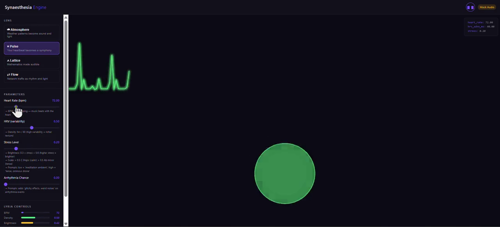

# Sonify

> *Hear what numbers hide. See what sound reveals.*

A browser-based platform that maps abstract data through deterministic pipelines into real-time music (via Google's Lyria 3) and synchronized Canvas visualizations. Four interchangeable "lenses" each sonify a different domain: weather, cardiac activity, mathematical attractors, and network traffic.

[](https://github.com/az9713/sonify/releases/download/v0.1.0/demo.mp4)

## Quick Start

```bash
cd sonify
pip install -r requirements.txt
python server.py
```

Open **http://localhost:8000** and click **Start Experience**.

Works immediately with mock audio. For real AI-generated music, see [API Key Setup](#api-key-setup) below.

## API Key Setup

1. Go to https://aistudio.google.com/apikey
2. Sign in and click **Create API key**
3. Copy `.env.example` to `.env` and paste your key:

```
GOOGLE_API_KEY=AIzaSy...your-key
```

The app uses the `lyria-realtime-exp` model. If your key doesn't have access, the app falls back to mock audio automatically.

## Architecture

```
Browser (index.html)
  |-- Canvas visualizer (per-lens renderer)
  |-- AudioWorklet (PCM playback from ring buffer)
  |-- WebSocket client
       |
       | ws://localhost:8000/ws
       |   text frames: {"viz": {...}, "controls": {...}}
       |   binary frames: raw PCM audio (16-bit, 48kHz, stereo)
       |
Python Server (server.py)
  |-- Tick loop (2-10 Hz depending on lens)
  |-- Active Lens
  |     |-- tick(t) -> domain data
  |     |-- map(data) -> ControlState {bpm, density, brightness, scale, prompts, ...}
  |     |-- viz_state(data) -> JSON for browser Canvas
  |-- Lyria Bridge (lyria_bridge.py)
        |-- Diffs ControlState, sends only changes to Lyria
        |-- Forwards PCM audio chunks to WebSocket
        |-- Falls back to sine-wave mock when no API key
```

## File Structure

```
sonify/
  pyproject.toml                  # Project metadata and dependencies
  requirements.txt                # pip install -r requirements.txt
  .env.example                    # GOOGLE_API_KEY placeholder
  server.py                       # FastAPI + WebSocket hub + tick loop

  lenses/
    base.py                       # ControlState dataclass + abstract Lens
    atmosphere.py                 # Weather lens
    pulse.py                      # Heart rate lens
    lattice.py                    # Math function lens
    flow.py                       # Network traffic lens

  lyria_bridge.py                 # Lyria session wrapper + mock fallback

  data_sources/
    simulators.py                 # All 4 domain simulators (pure Python)
    live_weather.py               # Open-Meteo fetcher (free, no key)

  static/
    index.html                    # Full frontend: UI + Canvas + AudioWorklet
    worklet.js                    # AudioWorklet processor for PCM buffering
```

## The 4 Lenses

| Lens | Data Source | Slider Parameters |
|------|-----------|-------------------|
| **Atmosphere** | Simulated weather (or live via Open-Meteo) | Storm Intensity, Season Shift |
| **Pulse** | Simulated cardiac model | Exercise Level, Stress Level |
| **Lattice** | Lorenz attractor / logistic map / sine waves | Chaos Parameter, Mode |
| **Flow** | Simulated network traffic (Poisson process) | Network Load |

## How Audio Correlates With Each Phenomenon

The audio is **never independent** of the data. Every tick, the simulator produces domain values, the lens maps them to audio controls via deterministic formulas, and those controls drive the audio engine. The same data simultaneously drives both the visuals and the sound.

The pipeline for every lens is:

```
Simulator generates data  -->  Lens.map() converts to ControlState  -->  Sent to audio engine
```

### Atmosphere (Weather)

| Simulator Value | Audio Control | Formula |
|---|---|---|
| `wind_speed` (0-100 m/s) | **BPM** | `70 + wind * 1.1` — gentle breeze = 70 bpm, gale = 180 bpm |
| `temperature` (-10 to 40 C) | **Brightness** | `(temp + 10) / 50` — cold = dim/muted, hot = bright/sharp |
| `humidity` (0-100%) | **Density** | `humidity / 100` — dry = sparse texture, humid = thick layers |
| `rain_probability` (0-1) | **Prompts** | Rain > 0.3 adds "Piano arpeggios" weighted by rain value |
| `wind > 60 AND rain > 0.5` | **Prompts** | Adds "Dirty synths, distortion, ominous drone" |
| `temperature` | **Prompts** | < 5C: "Ethereal, cold, sustained chords"; > 30C: "Warm acoustic guitar" |
| `storm_intensity` slider | Amplifies wind/rain | `wind * (1 + storm)`, `rain + storm * 0.3` |

**What you hear when Storm Intensity rises:** BPM climbs (wind increases), density thickens (humidity rises), piano arpeggios enter (rain crosses 0.3), and eventually distorted synths appear (wind > 60 + rain > 0.5). The particles on screen accelerate and rain drops appear from the same data.

### Pulse (Heart Rate)

| Simulator Value | Audio Control | Formula |
|---|---|---|
| `heart_rate` (40-200 bpm) | **BPM** | **1:1 mapping** — `max(60, min(200, hr))`. The music literally beats with the heart. |
| `hrv_sdnn_ms` (10-100 ms) | **Density** | `hrv / 80` — high variability = richer, more complex texture |
| `exercise_level` (0-1) | **Brightness** | `0.3 + exercise * 0.6` — resting = warm/dim, exercising = bright/sharp |
| `stress` (0-1) | **Scale** | < 0.5: C Major (consonant); > 0.5: Ab minor (tense) |
| `stress` (0-1) | **Prompts** | Low: "Meditation, ambient"; mid: "Lo-fi hip hop"; high: "Tense, ominous drone" |
| `arrhythmia` (bool) | **Prompts** | Adds "Glitchy effects, weird noises" on arrhythmia events |

**What you hear when Exercise Level rises:** Heart rate climbs, so BPM rises in lockstep. HRV drops (realistic physiology), so density increases. Brightness increases. Prompts shift from meditation to EDM. The ECG trace on screen speeds up at exactly the same rate.

### Lattice (Mathematics)

| Simulator Value | Audio Control | Formula |
|---|---|---|
| `amplitude` (0-1) | **Brightness** | Direct mapping — large attractor excursions = bright, near-origin = dim |
| `chaos_level` (0-1) | **Density** | Direct mapping — periodic orbit = sparse, chaotic = dense |
| `chaos_level` (0-1) | **BPM** | `80 + chaos * 80` — orderly = 80 bpm, chaotic = 160 bpm |
| `chaos_level` (0-1) | **Scale** | < 0.3: C Major; 0.3-0.6: D Major; > 0.6: Gb Major (chromatic) |
| `chaos_level` (0-1) | **Temperature** | `0.8 + chaos * 1.0` — more chaos = more Lyria randomness |
| `chaos_level` (0-1) | **Prompts** | Low: "Piano, melodic, classical"; mid: "Jazz fusion"; high: "Glitchy, experimental" |

The Chaos slider controls the Lorenz attractor's rho parameter (`rho = 10 + 35 * chaos`). The trajectory's variance is measured as `chaos_level`, and that single number drives BPM, density, scale, prompts, and temperature simultaneously.

**What you hear when Chaos rises:** Ordered piano becomes frantic glitch-noise, perfectly synchronized with the attractor visuals going from a clean figure-eight to a wild scatter.

### Flow (Network Traffic)

| Simulator Value | Audio Control | Formula |
|---|---|---|
| `packet_rate` (5-225/s) | **Density** | `packet_rate / 225` — idle network = thin, saturated = dense |
| `latency_ms` (1-85 ms) | **Brightness** | `1.0 - latency / 85` — low latency = bright, high = dark/sluggish |
| `is_burst` (bool) | **BPM** | Normal: `80 + load * 40`; Burst: adds +50 — sudden tempo spike |
| `load_level` (0-1) | **Prompts** | Low: "Ambient, minimal"; mid: "Chiptune"; high: "Drum & Bass, intense" |
| `is_burst` | **Prompts** | Adds "Huge drop, intense, crunchy distortion" |
| `error_rate` (0-0.15) | **Prompts** | > 0.05 adds "Glitchy effects, metallic twang" weighted by `error_rate * 5` |

**What you hear when a burst fires:** Packet rate spikes (density jumps), latency spikes (brightness drops), BPM jumps +50, a "Huge drop" prompt is injected. The node graph on screen turns red and pulses — all from the same `is_burst` flag.

### Mock Audio (No API Key)

When running without Lyria, the `MockAudioGenerator` receives the **exact same ControlState** and applies 8 of 9 fields:

| ControlState Field | Mock Audio Effect |
|---|---|
| `bpm` | **Rhythmic pulsing**: LFO rate = `bpm / 60` Hz — volume pulses at the beat rate |
| `brightness` | **Pitch**: `110 + brightness * 330` Hz (then quantized to active scale) |
| `density` | **Harmonic richness**: `1 + density * 5` overtones — sparse = pure sine, dense = rich harmonics |
| `scale` | **Pitch quantization**: snaps frequency to nearest note in the active scale (equal temperament) |
| `guidance` | **LFO regularity**: high guidance = deep metronomic pulse, low = shallow erratic wobble |
| `temperature` | **Noise floor**: adds Gaussian noise proportional to temperature (0 = pure, 3 = noisy) |
| `mute_bass` | **Harmonic filter**: removes fundamental + 2nd harmonic (thins the sound) |
| `mute_drums` | **LFO bypass**: disables rhythmic pulsing entirely (sustained drone) |
| `prompts` | **Not applied** — requires a generative AI model to interpret natural language |

The mock synth covers almost all control dimensions. When the Pulse lens shifts from C Major to Ab Major under stress, you hear the pitch snap to different scale tones. When chaos rises in the Lattice lens, guidance drops and the rhythmic pulse becomes erratic while the noise floor increases. Only the textual prompts (e.g., "Piano arpeggios" or "Glitchy effects") have no audible effect — these are a Lyria-only feature.

## Design Principles

1. **Lyria is downstream** — the model never decides meaning. Deterministic mappers control everything.
2. **Monotone mappings** — higher wind = higher BPM, always. Makes sonification learnable.
3. **Perceptual stability** — exponential moving average smoothing on all inputs prevents jarring transitions.
4. **All controls clamped** to Lyria's valid ranges (BPM 60-200, density 0-1, brightness 0-1, guidance 0-6).

## Troubleshooting

| Issue | Fix |
|-------|-----|
| No sound after clicking Start | Click anywhere on the page first (browser autoplay policy) |
| `ModuleNotFoundError` | Run `pip install -r requirements.txt` |
| Port 8000 in use | `set PORT=8001 && python server.py` |
| Lyria connection fails | App auto-falls back to mock audio. Check API key validity. |
| Live Weather not working | Toggle "Live Weather" in the Atmosphere lens sidebar. Requires internet. |
